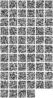
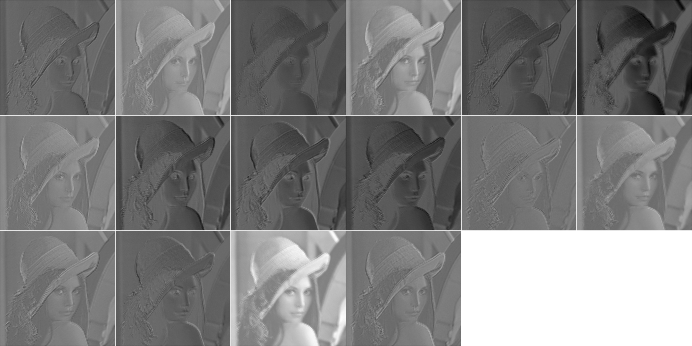

Começando com o Torch
==========================

Torch-7 fornece ambiente semelhante ao Matlab para algoritmos de aprendizado de máquina quase como uma obra-prima.
É fácil de usar e fornece uma implementação muito eficiente de CPUs e GPUs e usa Lua, uma linguagem simples, semelhante ao javascript.

## Instalando o Torch
Se você chegou aqui, você deve já deve ter o Torch instalado (e o iTorch). Se não, vá para o [Getting Started](torch.ch/docs/getting-started.html#_) página para instalar ___Torch___ em sua máquinao. A instalação é um processo de três simples comandos no Linux e OSX.

## Execução de Código em um Terminal
__Para este tutorial, vamos contar com a interface notebook iTorch para a execução de código e visualização.__

No entanto, se você deseja executar o código a partir de linha de comando, o Torch fornece um intérprete (como python ou MATLAB).
Você pode iniciar o interpretador em um terminal e executar comandos diretamente:
```bash
$ th

  ______             __   |  Torch7
 /_  __/__  ________/ /   |  Scientific computing for Lua.
  / / / _ \/ __/ __/ _ \  |
 /_/  \___/_/  \__/_//_/  |  https://github.com/torch
                          |  http://torch.ch

th> torch.Tensor{1,2,3}
 1
 2
 3
[torch.DoubleTensor of dimension 3]

th>
```

Para sair da sessão interativa, digite ^d ? a chave de controle junto com a tecla d, ou digite `os.exit()`. 

Uma vez que o usuário inseriu uma expressão completa, como `1 + 2`, e pressiona [Enter], a sessão interativa avalia a expressão e mostra o seu valor.

Para avaliar expressões escritas em um arquivo de origem `file.lua`, digite: 
```bash
th> dofile "file.lua".
```
Para executar código em um arquivo não-interativamente, você pode dá-lo como o primeiro argumento para o comando th:
```bash
$ th file.lua
```

Existem várias maneiras de executar código Lua e fornecem opções, semelhantes aos disponíveis para programas em `perl` ou `ruby`:
```bash
$ th -h
Usage: th [options] [script.lua [arguments]]

Options:
  -l name            load library name
  -e statement       execute statement
  -h,--help          print this help
  -a,--async         preload async (libuv) and start async repl (BETA)
  -g,--globals       monitor global variables (print a warning on creation/access)
  -gg,--gglobals     monitor global variables (throw an error on creation/access)
  -x,--gfx           start gfx server and load gfx env
  -i,--interactive   enter the REPL after executing a script
```

## iTorch notebooks
O pacote [iTorch](https://github.com/facebook/iTorch) permite fácil renderização de imagens, 
usando um navegador web padrão como um cliente gráficos.

É usado a UI [IPython](ipython.org/install.html) para permitir a execução de código e visualização em um navegador.

Antes de iniciar este tutorial, certifique-se de ter instalado [IPython](ipython.org/install.html) e o [iTorch](https://github.com/facebook/iTorch).

Você pode iniciar um notebook iTorch em um terminal da seguinte maneira:
```bash
$ itorch notebook
```

Agora, você tem uma interface iTorch no seu browser no http://localhost:8888 

Iniciar um novo notebook para executar seu código. Você pode digitar o seu código nas células de código, e pressione [Shift] + [Enter] juntas e digite seu código.

## Pacotes
Por padrão, o intérprete apenas pré-carrega ___torch___. pacotes adicionais, tais como ___image___ e ___nn___ deve ser requeridas manualmente:


```
require 'nn'
require 'image'
```

## Rendering / Displaying
iTorch permite que você exiba imagens, vídeos e áudio.


```
i = image.lena()
itorch.image(i)
```


Nestes tutoriais, vamos estar interessado em visualizar os estados internos e filtros de convolução:


```
-- visualizando pesos
n = nn.SpatialConvolution(1,64,16,16)
itorch.image(n.weight)
```





```
-- visualizando estados
n = nn.SpatialConvolution(1,16,12,12)
res = n:forward(image.rgb2y(image.lena()))
-- res here is a 16x501x501 state. We view it now as 16 separate images of size 1x501x501 using the :view function
res = res:view(res:size(1), 1, res:size(2), res:size(3))
itorch.image(res)
```





## Obtendo ajuda
A documentação do Torch é conduzido pela comunidade e é sempre um trabalho em andamento.

No entanto, você já pode obter ajuda para a maioria das funções previstas nos pacotes oficiais (torch/nn/gnuplot/image etc.).
A documentação está disponível nos repositórios git em cada pacote: [torch](https://github.com/torch/torch7/blob/master/README.md), [nn](https://github.com/torch/nn/blob/master/README.md), [image](https://github.com/torch/image/blob/master/README.md) etc.

#### Auto-complete
Uma maneira rápida de aprender funções e explorar os pacotes é usar o TAB-completion, ou seja, começe a digitar alguma coisa, e depois aperte [TAB] duas vezes:
```bash
th> torch.
Display all 175 possibilities? (y or n)
torch.abs(                  torch.floor(                torch.prod(
torch.acos(                 torch.ge(                   torch.pushudata(
torch.add(                  torch.gels(                 torch.rand(
torch.addcdiv(              torch.Generator.            torch.randn(
```

Isso funciona da mesma maneira, tanto no REPL de linha de comando e itorch.

#### Ajuda on-line
Para cada função que está documentado, você pode obter a sua documentação em linha usando o simbolo __?__ prefixado antes do nome da função.

Por exemplo:


```
?torch.randn
```


    
    +++++++++++++++++++++++++++++++++++++++++++++++++++++++++++++++++++++
    [1;35m[res] torch.randn([res,] m [,n...]) [0m
    
    
    [0;32m y=torch.randn(n) [0mreturns a one-dimensional tensor of size n filled 
    with random numbers from a normal distribution with mean zero and variance 
    one.
    
    [0;32m y=torch.randn(m,n) [0mreturns a mxn tensor of random numbers from a normal 
    distribution with mean zero and variance one.
    
    For more than 4 dimensions, you can use a storage as argument: [0;32m y=torch.rand(torch.LongStorage{m,n,k,l,o}) 
    [0m
    +++++++++++++++++++++++++++++++++++++++++++++++++++++++++++++++++++++	
    


## Indo além
#####Introdução ao Lua
Agora que você tem todas as peças básicas, nós convidamos você a dar uma olhada em um pequeno tutorial de 10 minutos sobre Lua aqui:
__http://learnxinyminutes.com/docs/lua/__

#####O que é o núcleo do Torch?

O núcleo Torch é uma biblioteca numérica geral, combinado com vários pacotes de alta qualidade que são necessárias para fazer as tarefas diárias no torch.

O núcleo da tocha consiste nos seguintes pacotes:
  * [torch](https://github.com/torch/torch7) : tensors, class factory, serialization, BLAS ;
  * [nn](https://github.com/torch/nn) : neural network Modules and Criterions;
  * [optim](https://github.com/torch/optim) : SGD, LBFGS and other optimization functions ;
  * [gnuplot](https://github.com/torch/gnuplot) : ploting and data visualization ;
  * [paths](https://github.com/torch/paths) : fazer diretórios, concatenar caminhos de arquivos, e outros utilitários do sistema de arquivos ;
  * [image](https://github.com/torch/image) : salvar, carregar, cortar, escalar, warp, traduzir imagens e tais ;
  * [trepl](https://github.com/torch/trepl) : o interpretador torch LuaJIT  ;
  * [cwrap](https://github.com/torch/cwrap) : usado para envolver funções C/CUDA em Lua ;

Cada repositório de pacotes geralmente inclui sua própria documentação através de um README.md que pode conter links para uma docs/diretório.

Além dos pacotes do núcleo, a distribuição também inclui
pacotes que permite a mais rotinas de computação intensiva para ser executado
perfeitamente usando gratuitamente o __NVIDIA Graphical Processing Units (GPUs)__ e a
linguagem de programação __NVIDIA CUDA__ . Estes pacotes velozes incluem :
 
  * [cutorch](https://github.com/torch/cutorch) : tensors and BLAS ;
  * [cunn](https://github.com/torch/cunn) : Modules and Criterions ;

Para a maior parte, convertendo tensores, módulos ou Características de CUDA
é tão fácil quanto :


```
require 'cutorch';
a = torch.randn(3,4)        -- create a torch.DoubleTensor()
b = a:cuda()                -- convert to a torch.CudaTensor()
c = torch.CudaTensor(3,4):zero()
d = torch.add(b,c)          -- d = b + c (note that this allocates memory for d)
d:add(b,c)                  -- like the previous line, but reuses existing result memory d
a:copy(d)                   -- copy torch.CudaTensor to back to CPU memory, i.e. torch.DoubleTensor
```

##### Third-party e pacotes da comunidade
Dezenas de pacotes de terceiros têm crescido em torno dos pacotes do núcleo do Torch.
Estes estão listados em Torch [Cheatsheet](https://github.com/torch/torch7/wiki/Cheatsheet).

Você pode instalar um pacote de comunidade geralmente usando o gerenciador de pacotes a partir do terminal ___luarocks__ . Por exemplo:
```bash
$ luarocks install penlight
```

## Forums ##

Para suporte, os usuários podem pesquisar o Torch
[Google Groups](https://groups.google.com/forum/embed/?place=forum%2Ftorch7#!forum/torch7) and ask questions.
A comunidade é geralmente muito rápido nas respostas.