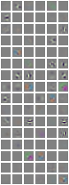
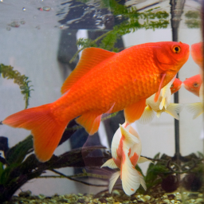
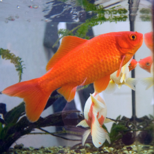

Demonstração de classificação Imagenet com o Torch7
=========

Estaremos usando Network-in-Network treinado no Torch7 com a normalização em lotes.

maiores informações sobre isto aqui
https://gist.github.com/szagoruyko/0f5b4c5e2d2b18472854

Importando os pacotes image e nn:

```lua
require 'image'
require 'nn'
```

### Download da imagem e  da rede

Faremos o download da imagens goldfish a partir da wikipedia (precisaremos do `wget` neste ponto)


```lua
local image_url = 'http://upload.wikimedia.org/wikipedia/commons/e/e9/Goldfish3.jpg'
local network_url = 'https://www.dropbox.com/s/npmr5egvjbg7ovb/nin_nobn_final.t7'
image_name = paths.basename(image_url)
network_name = paths.basename(network_url)
if not paths.filep(image_name) then os.execute('wget '..image_url)   end
if not paths.filep(network_name) then os.execute('wget '..network_url)   end
```

### Carregando a rede e mostrando sua estrutura


```lua
net = torch.load(network_name):unpack():float()
net:evaluate()
print(tostring(net))
```


    nn.Sequential {
      [input -> (1) -> (2) -> (3) -> (4) -> (5) -> (6) -> (7) -> (8) -> (9) -> (10) -> (11) -> (12) -> (13) -> (14) -> (15) -> (16) -> (17) -> (18) -> (19) -> (20) -> (21) -> (22) -> (23) -> (24) -> (25) -> (26) -> (27) -> (28) -> (29) -> (30) -> output]
      (1): nn.SpatialConvolution(3 -> 96, 11x11, 4,4, 5,5)
      (2): nn.ReLU
      (3): nn.SpatialConvolution(96 -> 96, 1x1)
      (4): nn.ReLU
      (5): nn.SpatialConvolution(96 -> 96, 1x1)
      (6): nn.ReLU
      (7): nn.SpatialMaxPooling(3,3,2,2,1,1)
      (8): nn.SpatialConvolution(96 -> 256, 5x5, 1,1, 2,2)
      (9): nn.ReLU
      (10): nn.SpatialConvolution(256 -> 256, 1x1)
      (11): nn.ReLU
      (12): nn.SpatialConvolution(256 -> 256, 1x1)
      (13): nn.ReLU
      (14): nn.SpatialMaxPooling(3,3,2,2,1,1)
      (15): nn.SpatialConvolution(256 -> 384, 3x3, 1,1, 1,1)
      (16): nn.ReLU
      (17): nn.SpatialConvolution(384 -> 384, 1x1)
      (18): nn.ReLU
      (19): nn.SpatialConvolution(384 -> 384, 1x1)
      (20): nn.ReLU
      (21): nn.SpatialMaxPooling(3,3,2,2,1,1)
      (22): nn.SpatialConvolution(384 -> 1024, 3x3, 1,1, 1,1)
      (23): nn.ReLU
      (24): nn.SpatialConvolution(1024 -> 1024, 1x1)
      (25): nn.ReLU
      (26): nn.SpatialConvolution(1024 -> 1024, 1x1)
      (27): nn.ReLU
      (28): nn.SpatialAveragePooling(7,7,1,1)
      (29): nn.View(-1)
      (30): nn.Linear(1024 -> 1000)
    }	


visualizando os pesos de conv1

```lua
itorch.image(net:get(1).weight)
```


    





### Carregando a imagem


```lua
im = image.load(image_name)
itorch.image(image.scale(im, 256, 256)) -- redimensiona apenas para mostrar a imagem
```





### Temos que redimensionar e normalizar a imagem


```lua
-- redimensiona e normaliza a imagem
function preprocess(im, img_mean)
  -- rescale the image
  local im3 = image.scale(im,224,224,'bilinear')
  -- subtrai a média de imagenet e divide por std
  for i=1,3 do im3[i]:add(-img_mean.mean[i]):div(img_mean.std[i]) end
  return im3
end

I = preprocess(im, net.transform):float()
itorch.image(I)
```





### Carregando synset
Carregando mapeamento saídas de __net__ para marcadores legíveis

```lua
synset_words = {}
for line in io.lines'7_imagenet_classification/synset_words.txt' do
    table.insert(synset_words, line:sub(11))
end
```

### Propagando através da rede
e classificar saídas em ordem decrescente e mostrar 5 melhores classes


```lua
local _,classes = net:forward(I):view(-1):sort(true)
for i=1,5 do
  print('predicted class '..tostring(i)..': ', synset_words[classes[i] ])
end
```


    predicted class 1: 	goldfish, Carassius auratus	
    predicted class 2: 	axolotl, mud puppy, Ambystoma mexicanum	
    predicted class 3: 	lorikeet	
    predicted class 4: 	hummingbird	
    predicted class 5: 	eft	


